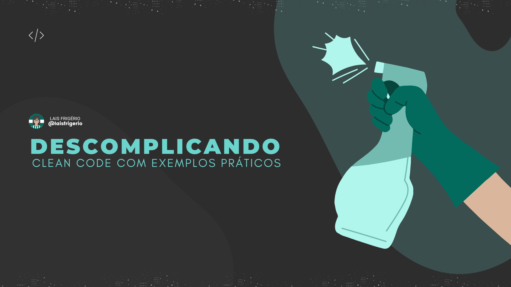

# ©️ Programaria Summit 2022 - Palestra

Tema: Descomplicando Clean Code com exemplos práticos 💚

  

## Código

Ao longo da apresentação, eu apresentei uma função [Original Code](./passo-a-passo/original-code.js) e ao longo da palestra nós refatoramos a função. Na pasta [/passo-a-passo](./passo-a-passo) tem todas as alterações, step by step!

## Challenge

É possível simplificar e aplicar mais boas práticas de programação. Deixo aqui os seguintes pontos:

- Como podemos "ocultar" a condicional da linha 19?
- Como podemos "ocultar" as instruções FOR?
- Como deixar apenas um FOR ao invés de 2?

**Não esqueça de me marcar nas redes sociais para a gente trocar ideias**

## 👩 Author

| [ <b>@laisfrigerio</b>](https://github.com/laisfrigerio)  |
| :---: |

## 📄 License

This project is licensed under the MIT License - see the LICENSE.md file for details
